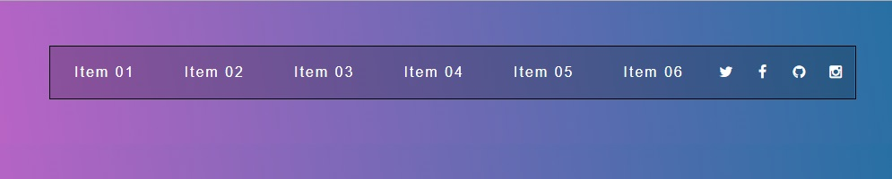

# Flexbox

**Aulas de Flexbox** [Courses-Wesbos](https://courses.wesbos.com)

**Guia Complementar** [CSS-Tricks](https://css-tricks.com/snippets/css/a-guide-to-flexbox/)

- [x] Introdução
- [x] Direção
- [x] Embrulhando Elementos
- [x] Ordem
- [x] Alinhamento e Centralização - justify-center
- [x] Alinhamento e Centralização - align-items
- [x] Alinhamento e Centralização - align-content
- [x] Alinhamento e Centralização - align-self
- [x] Tamanho utilizando propriedades Flex
- [x] Flex-grow, flex-shrink e flex-basis
- [x] Flex-basis e wrapping trabalhando junto
- [x] [Autoprefixer](https://autoprefixer.github.io/)
  - Instalar [Gulp](https://gulpjs.com/)
- [x] Flex-box navbar
- Navbar aberta
  
- Navbar fechada
  
